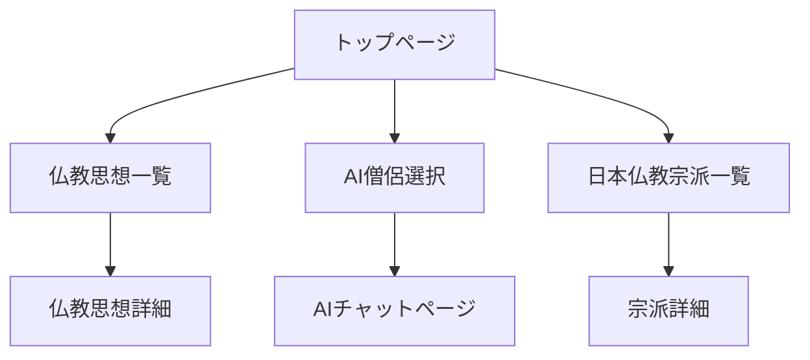

### 1\. 概要

#### 1.1. サイトの目的

本サイトは、仏教の普遍的な思想や教えを現代のテクノロジーを通じて分かりやすく提供し、ユーザーが日々の悩みや疑問を解消する一助となることを目的とします。仏教に関心を持つ人々が、その本質的な学びに触れ、心の安らぎを得られる場を目指します。

#### 1.2. サイトのコンセプト

**「いつでも、どこでも、ほとけの教えを。」**
難解なイメージのある仏教の思想を、直感的に学べる学習コンテンツと、AI（Gemini）を活用した対話形式の相談機能を通じて、より身近に感じられる体験を提供します。

#### 1.3. ターゲットユーザー

  * 仏教に興味はあるが、何から学べば良いか分からない方
  * 人生の悩みや漠然とした不安を抱え、心の拠り所を探している方
  * 日本の歴史や文化の根底にある仏教思想について理解を深めたい方

-----

### 2\. 機能要件

#### 2.1. 仏教思想学習機能

仏教の基本的な教えをテーマ別に学べるコンテンツを提供します。

  * **コンテンツ内容:**
      * 四苦八苦（生・老・病・死など）
      * 諸行無常・諸法無我・涅槃寂静
      * 縁起の法
      * 空（くう）の思想
      * その他、仏教の基本的な概念
  * **表示形式:** 各テーマについて、図解や平易な文章で解説する記事ページを作成します。

#### 2.2. AI僧侶への相談機能

Googleの生成AI「Gemini」を活用し、著名な僧侶を模したAIに悩みを相談できるチャット機能を提供します。

  * **相談相手の選択:**
      * ユーザーは相談したい僧侶を一覧から選択できます。
      * 初期の相談相手候補：
          * **釈迦:** 仏教の開祖として、普遍的かつ根本的な教えに基づいた回答をします。
          * **空海:** 真言宗の開祖。密教の視点から、現実世界での実践的な助言を与えます。
          * **道元:** 曹洞宗の開祖。禅の思想に基づき、自己との向き合い方を諭します。
  * **チャットインターフェース:**
      * シンプルなメッセージングUIを提供します。
      * ユーザーがメッセージを送信すると、選択した僧侶のキャラクター（プロンプト設定）に応じた回答がAIによって生成されます。
      * 会話の履歴は、ページを離れるまで保持されます。

#### 2.3. 日本仏教の宗派学習機能

日本国内における主要な仏教宗派の成り立ち、開祖、思想の特徴を学べるコンテンツを提供します。

  * **コンテンツ内容:**
      * 各宗派の概要（天台宗、真言宗、浄土宗、浄土真宗、臨済宗、曹洞宗、日蓮宗など）
      * 開祖と思想
      * 日本の歴史との関わり
  * **表示形式:**
      * 各宗派の解説ページを作成します。
      * 宗派間の関係性が視覚的に理解できる「宗派の系譜図」を掲載します。

-----

### 3\. 画面設計

#### 3.1. 画面一覧

  * **トップページ (`/`)**: サイトの紹介、各コンテンツへの導線。
  * **仏教思想一覧ページ (`/learn`)**: 学習テーマの一覧。
  * **仏教思想詳細ページ (`/learn/:slug`)**: 各テーマの解説記事。
  * **AI僧侶選択ページ (`/chat`)**: 相談相手の僧侶を選択するページ。
  * **AIチャットページ (`/chat/:monk`)**: 選択した僧侶と対話するページ。
  * **日本仏教宗派一覧ページ (`/sects`)**: 日本の宗派一覧と系譜図。
  * **宗派詳細ページ (`/sects/:slug`)**: 各宗派の解説記事。

#### 3.2. 画面遷移図

-----

### 4\. 技術仕様

#### 4.1. フロントエンド

  * **フレームワーク**: React
  * **ルーティング**: React Router
  * **UIコンポーネント**: Material-UI (MUI)
  * **ビルドツール**: Vite
  * **AI**: Google Gemini API

#### 4.2. デプロイ環境

  * **ホスティング**: GitHub Pages

#### 4.3. 注意事項・制約

  * **APIキーの管理**: GitHub Pagesは静的サイトホスティングのため、クライアントサイドにAPIキーを直接埋め込むことはセキュリティ上非常に危険です。開発段階では`.env`ファイルで管理し、公開リポジトリに含めないように注意してください。
      * **本番リリース時の推奨構成**: セキュリティを確保するため、APIリクエストを中継するサーバーレス関数（Cloudflare Workers, Vercel Functionsなど）を別途用意し、そこからGemini APIを呼び出す構成への変更を強く推奨します。

-----

### 5\. 今後の展望

  * **相談履歴の保存機能**: ユーザーが過去の相談内容を振り返れるように、ローカルストレージやログイン機能と連携したデータベースへの保存機能を追加します。
  * **コンテンツの拡充**: 仏像の種類や仏教美術に関する解説、お経の現代語訳など、学習コンテンツをさらに充実させます。
  * **多言語対応**: 日本語だけでなく、英語など他の言語にも対応し、より多くのユーザーに利用してもらえるようにします。